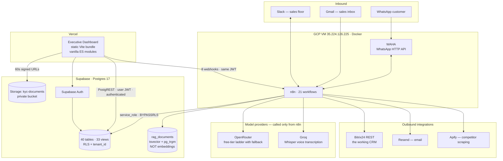

# System Architecture

Corrected 2026-09-03 against the live systems. The previous edition of this
diagram drew a **NodeJS API Gateway**, a separate **pgvector RAG store**, five
distinct "NEXUS OS Modules", **Bank Loan APIs** and **Incoming Calls**. None of
those exists. There is no application server anywhere in this product: the front
end is a static bundle that talks to Supabase and to n8n directly from the
browser.

## The stack is four things

| | what it is | where |
|---|---|---|
| **Supabase** | Postgres 17. The only data store — leads, inventory, messages, audit, RAG, policy, tenancy. 40 tables, 33 views. | project `dsvuoovivysszdoiorch` |
| **n8n** | 21 workflows under Docker. Every automation and every AI call. Writes as `service_role`. | GCP VM `35.224.126.225`, `https://35.224.126.225.nip.io` |
| **WAHA** | self-hosted WhatsApp HTTP API. The WhatsApp transport, both directions. | same VM |
| **Executive Dashboard** | a static Vite bundle — vanilla ES modules, no framework, no server. | Vercel |

## What is deliberately absent

Each of these has appeared in an earlier document about this system and **none of
them is in the live path**:

- **No application server.** No Node API, no Express, no `/api/v1/*`. The
  dashboard is static files; every read is PostgREST and every action is an n8n
  webhook.
- **No React, no framework, no Tailwind.** Vanilla ES modules built by Vite;
  Tailwind was removed and `postcss.config.js` records why.
- **No WebSocket, no Socket.io, no event bus.** Screens fetch; a badge poller
  re-fetches on an interval. Nothing is pushed.
- **No MongoDB.** Supabase is the only data store.
- **No Odoo.** The live ERP sync target is **Bitrix24 REST**
  (`wf_108 ERP Sync - Bitrix24`).
- **No FastAPI / Python service.** Ask AI is an n8n workflow.
- **No OpenAI.** There is no OpenAI credential on the box. Generation is
  OpenRouter free-tier models behind a fallback ladder; Groq runs Whisper for
  voice notes.
- **No embeddings behind Ask AI.** `rag_documents` is `tsvector` full-text plus
  `pg_trgm`. `document_embeddings` does not exist.
- **Make.com and Zapier are not in the live path.** Make holds two inactive
  scenarios with 0 executions.

## Architecture principles

1. **Automation is n8n, and only n8n.** Every scheduled job, every AI call and
   every outbound message runs there. The browser starts a workflow by calling a
   webhook with the signed-in user's Supabase JWT; the workflow verifies it.
2. **Supabase is the single source of truth** for inventory, leads, customer
   state, audit and access control. Bitrix24 is the sales team's working CRM and
   is synchronised one-way from Supabase.
3. **The browser holds no privilege it should not.** The dashboard reads as
   `authenticated` under RLS. It has exactly one write helper and two direct
   table write paths (`inventory`, `leads.assigned_to_id`); everything else goes
   through `SECURITY DEFINER` RPCs owned by `postgres`.
4. **n8n writes as `service_role`, which is `BYPASSRLS`.** Nothing in the
   database filters a workflow's writes. Whatever guards a workflow endpoint is
   the whole of the guard — see the open-webhook section of `CLAUDE.md`.
5. **Two AI providers, deliberately free-tier, with a fallback ladder.** A model
   being unavailable is a normal condition and the workflows are built to fall
   through rather than fail.
